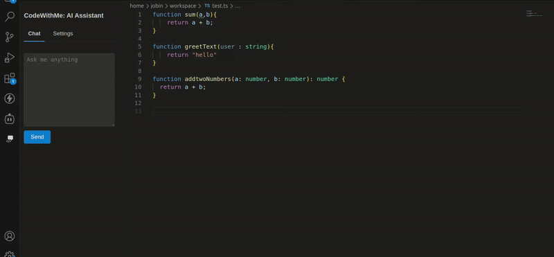

### Autocomplete Assistant for Large Langauge Models (LLMs)
You can use this plugin for following LLMS
* OpenWebUI
* Ollama
* OpenRouter
* ChatGPT

### How it works

### How to Setup

You need the following information

* API URL (eg: https://openrouter.ai/)
* API Key (eg: zpdmXZYJCnnCQk6h2VKSJx2iFhu5S_H)
* Model Name (eg: qwen/qwen-2.5-coder-32b-instruct:free)

Make sure to use the base url only for all the providers no need to enter full url
`api/v1/chat/completions` or `/api/generate` etc will added automatically from the plugin.

